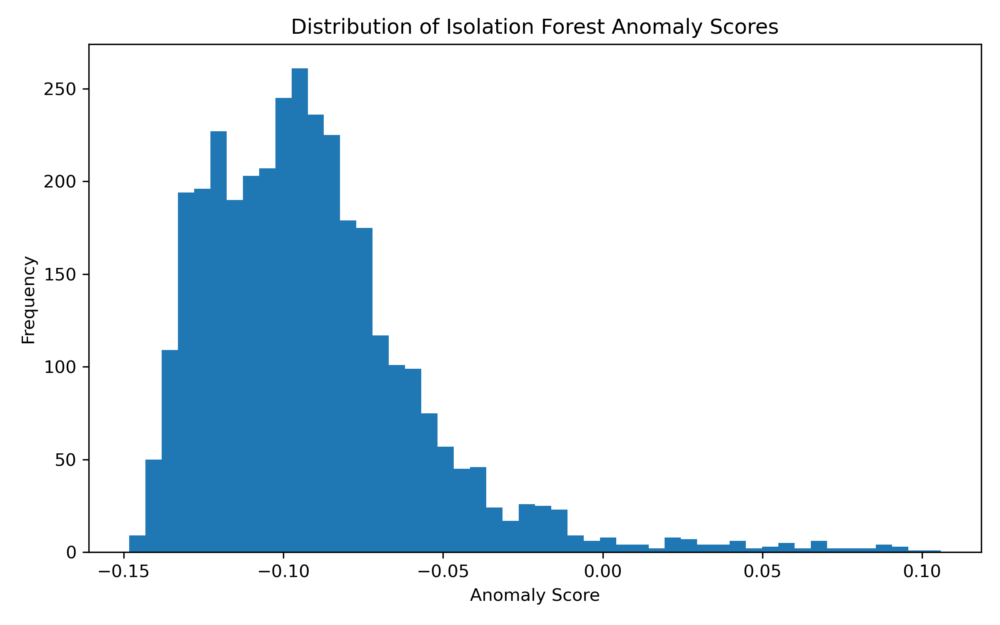
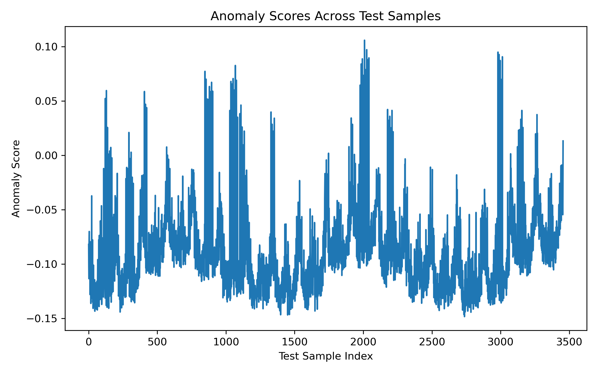
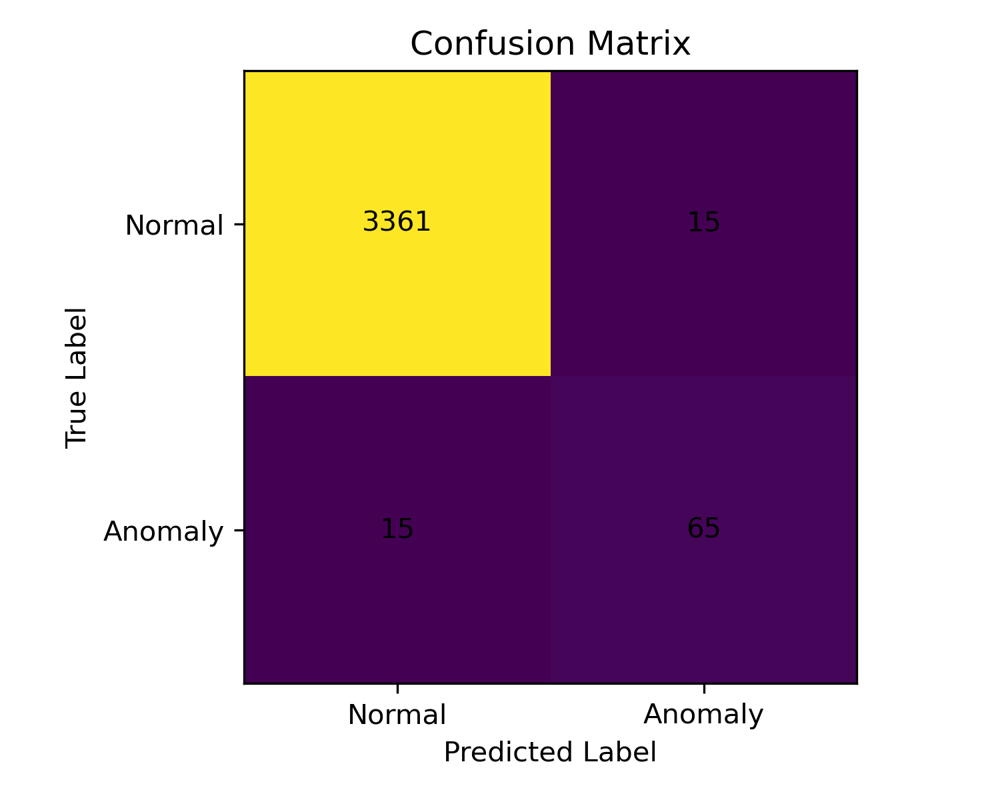

# AWS-Based Time-Series Anomaly Detection Pipeline for Operational Intelligence

## Overview

This project presents an end-to-end AI/ML pipeline for detecting anomalies in telecom network KPI time-series data. The objective is to support operational intelligence by identifying abnormal network behavior that may indicate service degradation, congestion, instability, or performance issues.

The project combines a local machine learning baseline with AWS cloud components, including Amazon S3 and Amazon SageMaker.

## Use Case

Telecom networks continuously generate large volumes of operational KPI data, including throughput, latency, packet loss, handover success rate, call drop rate, and radio resource utilization. Detecting abnormal KPI patterns early can help network operations teams investigate issues before they significantly affect customer experience.

This project simulates a telecom KPI monitoring scenario and applies anomaly detection to identify unusual network behavior.

## Project Architecture

```text
Synthetic Telecom KPI Data
        |
        v
Local Data Preparation and Feature Engineering
        |
        v
Local ML Baseline: Isolation Forest
        |
        v
Amazon S3 Data Storage
        |
        v
Amazon SageMaker Random Cut Forest Training
        |
        v
Evaluation, Scoring, and Reporting
```

## Dataset

A synthetic telecom KPI dataset was generated for this project.

| Item | Value |
|---|---:|
| Total records | 11,520 |
| Number of modeling features | 9 |
| Test records | 3,456 |
| True anomalies in test set | 80 |
| True anomaly rate in test set | 2.31% |

The dataset includes time-series KPI patterns and injected anomalies to simulate abnormal telecom network behavior.

## Machine Learning Approach

Two anomaly detection approaches were used:

1. **Local baseline model**
   - Isolation Forest
   - Used for final evaluation and scoring

2. **AWS cloud model**
   - Amazon SageMaker built-in Random Cut Forest
   - Used to demonstrate cloud-based anomaly detection training

## Local Model Results

The final local anomaly detection baseline used Isolation Forest with a selected contamination value of `0.025`.

| Metric | Value |
|---|---:|
| Precision | 0.8125 |
| Recall | 0.8125 |
| F1-score | 0.8125 |
| True anomalies | 80 |
| Predicted anomalies | 80 |
| Predicted anomaly rate | 2.31% |

## AWS Cloud Component

The following AWS components were used:

- Amazon S3 for storing raw and processed datasets
- Amazon SageMaker Notebook Instance for cloud-based experimentation
- Amazon SageMaker built-in Random Cut Forest algorithm for anomaly detection training
- AWS Service Quotas for checking transform job limits

The SageMaker Random Cut Forest model was trained successfully, and the model artifact was stored in Amazon S3.

## Cloud Deployment Note

Batch inference was planned using SageMaker Batch Transform. However, the AWS account-level quota for `ml.m5.large for transform job usage` was set to `0`, and the quota increase request was not approved at this stage due to limited account usage history.

Therefore, the final evaluation in this portfolio version is based on the local Isolation Forest baseline, while the SageMaker Random Cut Forest training step demonstrates the cloud-training component of the pipeline.

## Final Outputs

The project generates the following outputs:

```text
outputs/
    final_scored_kpi_data.csv
    isolation_forest_evaluation_metrics.csv
    confusion_matrix.csv
    top_50_anomalies.csv
    project_summary.txt

diagrams/
    anomaly_score_distribution.png
    anomaly_scores_over_time.png
    confusion_matrix.png
```

## Visual Results

### Anomaly Score Distribution



### Anomaly Scores Across Test Samples



### Confusion Matrix



## Repository Structure

```text
aws-kpi-anomaly-detection/
│
├── data/
│   ├── synthetic_telecom_kpi_data.csv
│   ├── sagemaker_train_features.csv
│   ├── sagemaker_test_features.csv
│   ├── sagemaker_test_labels.csv
│   └── sagemaker_test_metadata.csv
│
├── notebooks/
│   ├── 01_generate_dataset.ipynb
│   ├── 02_local_anomaly_detection.ipynb
│   ├── 03_prepare_sagemaker_data.ipynb
│   └── 04_final_evaluation_and_outputs.ipynb
│
├── outputs/
│   ├── final_scored_kpi_data.csv
│   ├── isolation_forest_evaluation_metrics.csv
│   ├── confusion_matrix.csv
│   ├── top_50_anomalies.csv
│   └── project_summary.txt
│
├── diagrams/
│   ├── anomaly_score_distribution.png
│   ├── anomaly_scores_over_time.png
│   └── confusion_matrix.png
│
├── requirements.txt
├── README.md
└── .gitignore
```

## Skills Demonstrated

- Time-series anomaly detection
- Telecom KPI analytics
- Operational intelligence use case design
- Synthetic data generation
- Feature engineering and model evaluation
- Isolation Forest anomaly detection
- Amazon S3 data storage
- Amazon SageMaker built-in algorithm training
- AWS quota handling and cost-aware cloud execution
- GitHub-ready ML project documentation

## Cost Control

To avoid unnecessary AWS charges, the SageMaker notebook instance was stopped after use. No persistent SageMaker endpoint was deployed.
